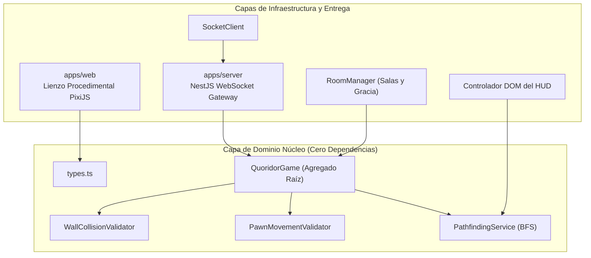
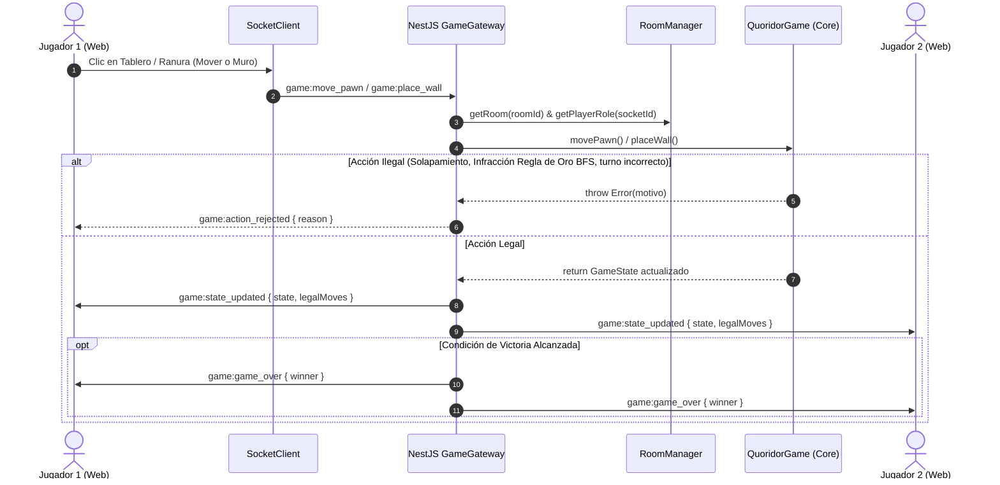
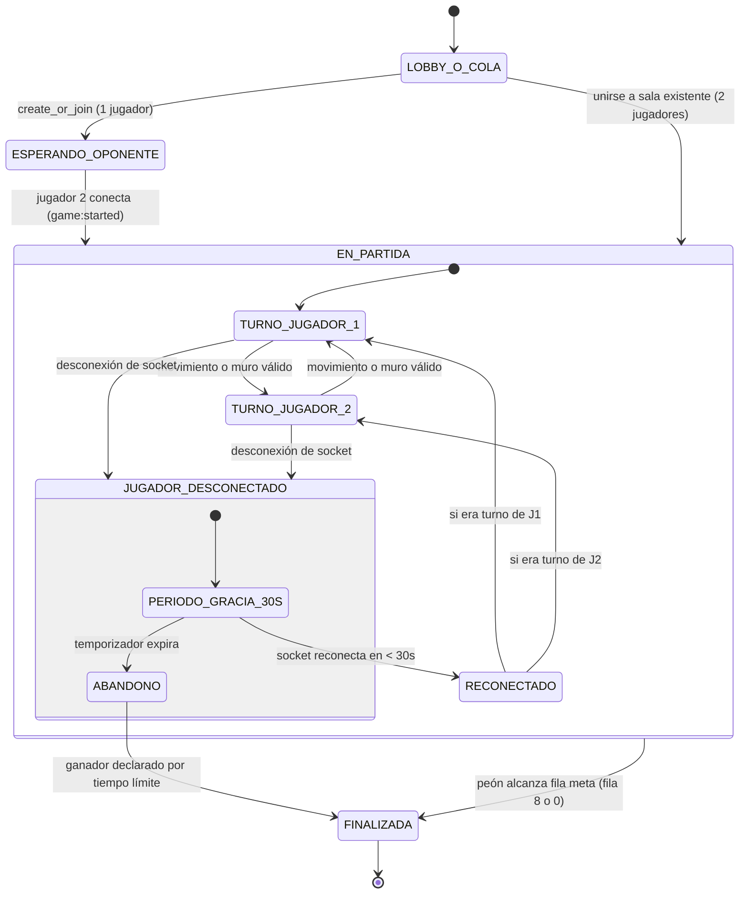

# Quoridor: Motor de Juego Autoritativo y Cliente en Tiempo Real

> Una adaptación web multijugador 1v1 en tiempo real y autoritativa del clásico juego de mesa de estrategia abstracta **Quoridor**, diseñada con un núcleo de dominio con cero dependencias, búsqueda en anchura (BFS) en tiempo real para validación de caminos, WebSockets con NestJS y gráficos 100% procedimentales en PixiJS v8.

[English 🇬🇧](README.md) | **Español**

[]()
[]()
[]()
[]()
[]()

---

## 1. Presentación del Proyecto y Aspectos Técnicos Destacados

Quoridor es un juego asimétrico de obstrucción espacial y carrera de caminos. Esta implementación ofrece una arquitectura web determinista y de alto rendimiento:

- **Núcleo de Dominio con Cero Dependencias (`packages/core`)**: Lógica pura en TypeScript, validadores de límites geométricos, mecánicas de salto de peón y algoritmo de búsqueda de caminos (BFS), completamente desacoplados de frameworks de servidor o librerías de interfaz.
- **Patrón de Servidor Autoritativo (`apps/server`)**: WebSocket Gateway en NestJS impulsado por Socket.io. Los clientes envían intenciones de juego (`game:move_pawn`, `game:place_wall`); el servidor simula y valida las reglas sobre el agregado autoritativo `QuoridorGame`, rechazando jugadas ilegales y transmitiendo instantáneas de estado sincronizadas (`game:state_updated`).
- **Búsqueda de Caminos en Grafos en Tiempo Real (Invariante BFS)**: Evaluación instantánea de la **Regla de Oro** (ningún muro puede bloquear por completo el camino de ninguno de los jugadores a su meta) ejecutada en $< 0.05\text{ ms}$ sobre una cuadrícula de 81 nodos, brindando respuesta visual a 60 FPS al pasar el cursor.
- **Gráficos 100% Procedimentales (`apps/web`)**: Renderizado con PixiJS v8 utilizando primitivas vectoriales (`PIXI.Graphics`). No se utilizan texturas externas PNG/JPG ni hojas de sprites, garantizando latencia cero de descarga de recursos y nitidez absoluta en pantallas de cualquier resolución (pantallas Retina/4K).
- **Emparejamiento y Período de Gracia por Desconexión**: Cola de emparejamiento automático 1v1 integrada, salas compartibles mediante parámetros de URL (`?room=XYZ`) y ventana de gracia de 30 segundos ante desconexiones accidentales antes de declarar abandono.
- **Internacionalización Completa (i18n)**: Interfaz bilingüe (Español e Inglés) con autodetección del idioma del navegador, selector manual persistente y tutorial interactivo de bienvenida.
- **Contenedorización para Producción**: Archivos `Dockerfile` optimizados por capas y `docker-compose.yml` listos para orquestar cliente web (Nginx) y backend en un solo comando.

---

## 2. Guía del Juego: ¿Cómo Jugar a Quoridor?

Quoridor es un duelo táctico por turnos donde cada jugador busca alcanzar el lado opuesto del tablero antes que su rival, usando muros para obstaculizar el avance enemigo sin quedar atrapado en su propia trampa.

```
       [META DE JUGADOR 2 / FILA 0]
       +---+---+---+---+---+---+---+---+---+
       |   |   |   |   | P1|   |   |   |   |  <- P1 empieza en (0, 4)
       +---+---+---+---+---+---+---+---+---+
       |   |   |   |   |   |   |   |   |   |
       +===+===+---+---+---+---+---+---+---+  <- Muro Horizontal (2 casillas)
       |   |   |   |   |   |   |   |   |   |
       +---+---+---+---+---+---+---+---+---+
       |   |   |   |   |   | | |   |   |   |  <- Muro Vertical
       +---+---+---+---+---+ | +---+---+---+
       |   |   |   |   |   | | |   |   |   |
       +---+---+---+---+---+---+---+---+---+
       |   |   |   |   | P2|   |   |   |   |  <- P2 empieza en (8, 4)
       +---+---+---+---+---+---+---+---+---+
       [META DE JUGADOR 1 / FILA 8]
```

### 2.1 Reglas Fundamentales (Paso a Paso)

1. **Objetivo de la Victoria**:
   - **Jugador 1 (Cian Eléctrico)**: Empieza en la casilla central superior `(0, 4)`. Gana al alcanzar cualquier casilla de la fila inferior (`Fila 8`).
   - **Jugador 2 (Coral Radiante)**: Empieza en la casilla central inferior `(8, 4)`. Gana al alcanzar cualquier casilla de la fila superior (`Fila 0`).

2. **Acciones por Turno (Elige UNA)**:
   - **Opción A: Mover tu Peón**:
     - Haz clic en cualquiera de los discos luminosos que aparecen alrededor de tu ficha en casillas válidas.
     - Puedes moverte 1 casilla ortogonalmente (arriba, abajo, izquierda, derecha) si no hay un muro bloqueando el paso.
     - **Salto Recto**: Si tu rival está en una casilla adyacente y no hay un muro detrás de él, puedes saltar directamente por encima de él.
     - **Salto Diagonal**: Si el salto recto está bloqueado por un muro o por el límite del tablero, puedes saltar diagonalmente a cualquiera de los dos lados libres del rival.
   - **Opción B: Colocar un Muro**:
     - Cada jugador cuenta con **10 muros** por partida.
     - Pasa el cursor sobre las **ranuras o intersecciones guía entre casillas** para previsualizar el muro fantasma.
     - Pulsa <kbd>Espacio</kbd> o <kbd>R</kbd> (o el botón "Girar Muro") para alternar entre orientación **Horizontal** y **Vertical**.
     - Haz clic para colocarlo. El muro bloquea el paso para ambos jugadores por igual.

3. **La Regla de Oro (Invariante de Camino Libre)**:
   - **¡Está terminantemente prohibido encerrar por completo a un jugador!**
   - Siempre debe existir al menos un camino transitable hacia la fila de meta para ambos jugadores.
   - Si intentas colocar un muro que corte el último camino disponible del rival o el tuyo, el motor detecta la infracción mediante **BFS** en tiempo real, resalta el muro en **rojo translúcido** y rechaza la jugada.

### 2.2 Controles Rápidos y Atajos de Teclado

| Control / Atajo | Acción |
| :--- | :--- |
| **Puntero del Ratón** | Pasa sobre casillas para ver movimientos legales o sobre ranuras para previsualizar muros |
| <kbd>Espacio</kbd> o <kbd>R</kbd> | Alternar orientación del muro (**Horizontal** $\leftrightarrow$ **Vertical**) |
| **Clic Izquierdo** | Confirmar movimiento de ficha o colocación de muro |
| **Botón ❓ ¿Cómo Jugar?** | Reabrir el diálogo explicativo interactivo en cualquier momento |
| **Selector [ ES \| EN ]** | Cambiar idioma al instante entre Español e Inglés |

---

## 3. Invariantes del Dominio y Reglas Matemáticas

### Definiciones Matemáticas del Tablero y Geometría de Muros

El tablero de Quoridor es una cuadrícula ortogonal de $9 \times 9$ casillas:
$$\text{Coordenadas de Casillas: } (r, c) \in \{0, \dots, 8\} \times \{0, \dots, 8\}$$

Los muros se colocan en las ranuras entre casillas, anclados en su intersección superior izquierda:
$$\text{Coordenadas de Anclaje: } (r, c) \in \{0, \dots, 7\} \times \{0, \dots, 7\}$$
$$\text{Orientación: } \theta \in \{\text{HORIZONTAL}, \text{VERTICAL}\}$$

Cada muro cubre exactamente dos casillas contiguas y la ranura intermedia.

#### Invariantes de Validación para la Colocación de Muros

1. **Invariante de Límites del Tablero**:
   $$0 \le r \le 7 \quad \text{y} \quad 0 \le c \le 7$$

2. **Invariante de Intersección Perpendicular (`+`)**:
   Dos muros de orientaciones opuestas no pueden compartir el mismo punto de anclaje de intersección:
   $$\forall W_1(r_1, c_1, \text{H}), \, W_2(r_2, c_2, \text{V}): \quad (r_1, c_1) \ne (r_2, c_2)$$

3. **Invariante de Solapamiento Paralelo**:
   Dos muros con la misma orientación no pueden compartir ni atravesar el mismo borde de casilla:
   - Para muros Horizontales:
     $$r_1 = r_2 \implies |c_1 - c_2| \ge 2$$
   - Para muros Verticales:
     $$c_1 = c_2 \implies |r_1 - r_2| \ge 2$$

#### Mapeo de Obstrucción de Movimiento

Un paso ortogonal desde $(r, c)$ hacia $(r', c')$ queda bloqueado si:
- Movimiento hacia **ARRIBA** $(r - 1, c)$: Bloqueado por un muro horizontal en $(r - 1, c)$ o en $(r - 1, c - 1)$.
- Movimiento hacia **ABAJO** $(r + 1, c)$: Bloqueado por un muro horizontal en $(r, c)$ o en $(r, c - 1)$.
- Movimiento hacia la **IZQUIERDA** $(r, c - 1)$: Bloqueado por un muro vertical en $(r, c - 1)$ o en $(r - 1, c - 1)$.
- Movimiento hacia la **DERECHA** $(r, c + 1)$: Bloqueado por un muro vertical en $(r, c)$ o en $(r - 1, c)$.

#### Saltos de Peón

Cuando un jugador se encuentra directamente adyacente a su rival:
1. **Salto Recto**: Si la casilla directamente detrás del rival está dentro del tablero y no está bloqueada por un muro, el jugador **debe** realizar un salto recto.
2. **Salto Diagonal**: Si el salto recto está bloqueado (ya sea por un muro detrás del rival o por el borde del tablero), el jugador puede saltar diagonalmente a cualquiera de los dos lados abiertos del rival.

#### La Regla de Oro: Invariante de Camino mediante BFS

Una propuesta de colocación de muro $W_{\text{candidate}}$ es legal si y solo si:
$$\text{hasPathToGoal}(P_1, \text{fila}=8, \text{Muros} \cup \{W_{\text{candidate}}\}) = \text{true}$$
$$\land \; \text{hasPathToGoal}(P_2, \text{fila}=0, \text{Muros} \cup \{W_{\text{candidate}}\}) = \text{true}$$

#### Por qué BFS es Óptimo

Propiedades del grafo de Quoridor:
- Vértices: $|V| = 81$
- Aristas: Cada casilla tiene grado $d \le 4$, por lo que $|E| \le 144$
- Complejidad Temporal de BFS: $\mathcal{O}(|V| + |E|) = \mathcal{O}(81 + 144) \le 225 \text{ operaciones}$
- Complejidad Espacial de BFS: $\mathcal{O}(|V|) = 81 \text{ bytes}$ (utilizando `Uint8Array(81)`)

Dado que el costo de las aristas es uniforme (cada paso cuesta 1 turno), BFS garantiza encontrar el camino más corto en tiempo lineal. En motores modernos de JavaScript, cada ejecución de BFS toma **$\mathbf{< 0.05\text{ ms}}$**, permitiendo validar la vista previa del muro fantasma en cada movimiento del ratón sin la más mínima pérdida de fluidez.

---

## 4. Diagramas de Arquitectura

### 4.1 Arquitectura Hexagonal (Núcleo Desacoplado)



---

### 4.2 Diagrama de Secuencia del Ciclo de Turno



---

### 4.3 Diagrama de Máquina de Estados



---

## 5. Cómo Ejecutar Localmente

### Prerrequisitos
- Node.js $\ge 20$
- pnpm $\ge 10$ (o corepack / npm)

### 5.1 Desarrollo Local (Recarga Rápida / Hot Reload)

```bash
# 1. Instalar dependencias en todos los paquetes del monorepo
pnpm install

# 2. Compilar el núcleo de dominio
pnpm --filter @quoridor/core run build

# 3. Ejecutar servidor y cliente web concurrentemente
pnpm dev

# Alternativamente, ejecutarlos en terminales separadas:
# Terminal 1: Servidor Autoritativo NestJS (puerto 3001)
pnpm dev:server

# Terminal 2: Cliente Vite + PixiJS (puerto 5173)
pnpm dev:web
```

Abre `http://localhost:5173` en dos pestañas o ventanas del navegador para jugar 1v1 en tiempo real.

---

### 5.2 Ejecución de la Suite de Pruebas

Ejecuta el conjunto completo de pruebas unitarias y de integración que cubren el núcleo de dominio, reglas de movimiento, búsqueda de caminos con BFS y WebSocket de extremo a extremo:

```bash
# Ejecutar todas las pruebas del monorepo
pnpm test

# Ejecutar pruebas para paquetes específicos
pnpm --filter @quoridor/core run test
pnpm --filter @quoridor/server run test

# Verificar tipos de TypeScript
pnpm run typecheck
```

---

### 5.3 Ejecución Contenedorizada (Docker Compose)

Inicia la arquitectura multicapa completa con un solo comando:

```bash
docker-compose up --build
```

- **Cliente Web**: `http://localhost:8080` (servido mediante Nginx alpine con proxy inverso para WebSockets)
- **Servidor Autoritativo**: `http://localhost:3001` (NestJS WebSocket gateway)

---

## 6. Paleta Visual y Tema Estético

| Elemento | Código Hexadecimal | Rol Visual |
| :--- | :--- | :--- |
| **Fondo del Tablero** | `#0F172A` | Pizarra oscura profunda (Deep Slate) |
| **Casillas del Tablero** | `#1E293B` | Carbón pulido con esquinas redondeadas de 4px |
| **Ranuras e Intersecciones**| `#090D16` | Carriles de muro intercelulares de 8px con puntos guía |
| **Peón Jugador 1** | `#00E5FF` | Ficha Cian Eléctrico con resplandor difuso |
| **Peón Jugador 2** | `#FF5252` | Ficha Coral Radiante con resplandor difuso |
| **Muro Firme Colocado** | `#F59E0B` | Arenisca cálida / Ámbar dorado |
| **Muro Fantasma Válido** | `#00E5FF` | Previsualización en cian translúcido (`alpha: 0.6`) |
| **Muro Fantasma Inválido**| `#EF4444` | Previsualización en rojo translúcido (`alpha: 0.65`) |
