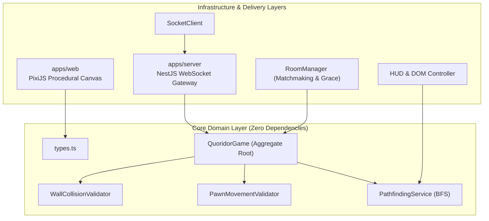
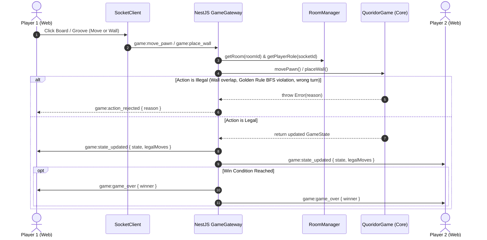
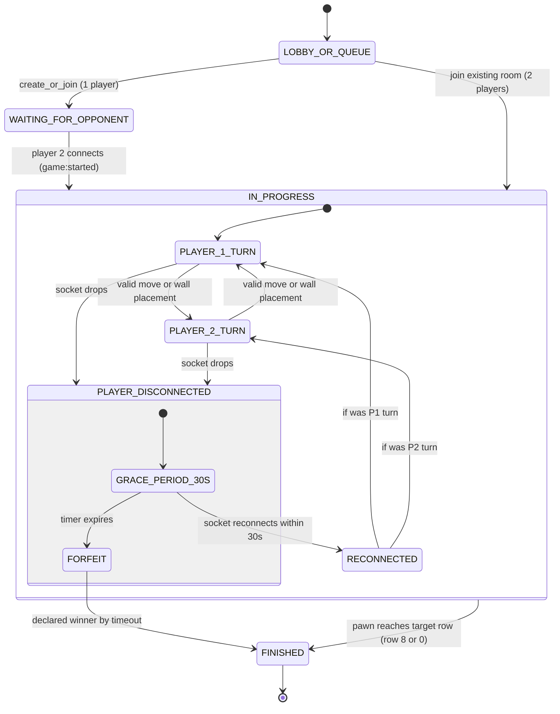

# Quoridor: Real-Time Authoritative Game Engine & Client

> An authoritative real-time 1v1 multiplayer web adaptation of the classic abstract strategy board game **Quoridor**, engineered with a zero-dependency domain core, real-time Breadth-First Search (BFS) pathfinding, NestJS WebSockets, and 100% procedural PixiJS v8 graphics.

**English** | [Español 🇪🇸](README.es.md)

[]()
[]()
[]()
[]()
[]()

---

## 1. Project Pitch & Engineering Highlights

Quoridor is an asymmetric game of spatial obstruction and path race. This implementation delivers a high-performance, deterministic web architecture:

- **Zero-Dependency Domain Core (`packages/core`)**: Pure TypeScript domain logic, boundary validators, jump mechanics, and BFS pathfinding completely isolated from presentation or server frameworks.
- **Authoritative Server Pattern (`apps/server`)**: NestJS WebSocket Gateway powered by Socket.io. Clients dispatch user intents (`game:move_pawn`, `game:place_wall`); the server simulates and validates rules against the authoritative `QuoridorGame` aggregate, rejecting illegal actions and broadcasting synchronized state snapshots (`game:state_updated`).
- **Real-Time Graph Pathfinding (BFS Invariant)**: Instant evaluation of the **Golden Rule** (no wall placement may completely trap either player) running in $< 0.05\text{ ms}$ over the 81-node grid, delivering 60 FPS responsive hover feedback.
- **100% Procedural Graphics (`apps/web`)**: Built with PixiJS v8 using vector drawing primitives (`PIXI.Graphics`). No external PNG/JPG textures, sprite sheets, or asset downloads are used—yielding zero asset latency and crisp resolution across all displays.
- **Matchmaking & Reconnection Grace**: Built-in 1v1 matchmaking queue, room sharing via URL parameters (`?room=XYZ`), and 30-second reconnection grace period before declaring forfeit.
- **Internationalization (i18n)**: Fully bilingual interface (English & Español) with automatic browser locale detection, manual toggle, and interactive welcome tutorial.
- **Production Containerization**: Fully reproducible `Dockerfile`s and `docker-compose.yml` orchestrating client and server with a single command.

---

## 2. Game Guide: How to Play Quoridor

Quoridor is a turn-based tactical duel where each player aims to reach the opposite side of the board before their rival, using walls to obstruct the opponent's path without getting trapped in their own maze.

```
       [PLAYER 2 GOAL / ROW 0]
       +---+---+---+---+---+---+---+---+---+
       |   |   |   |   | P1|   |   |   |   |  <- P1 starts at (0, 4)
       +---+---+---+---+---+---+---+---+---+
       |   |   |   |   |   |   |   |   |   |
       +===+===+---+---+---+---+---+---+---+  <- Horizontal Wall (2 cells)
       |   |   |   |   |   |   |   |   |   |
       +---+---+---+---+---+---+---+---+---+
       |   |   |   |   |   | | |   |   |   |  <- Vertical Wall
       +---+---+---+---+---+ | +---+---+---+
       |   |   |   |   |   | | |   |   |   |
       +---+---+---+---+---+---+---+---+---+
       |   |   |   |   | P2|   |   |   |   |  <- P2 starts at (8, 4)
       +---+---+---+---+---+---+---+---+---+
       [PLAYER 1 GOAL / ROW 8]
```

### 2.1 Fundamental Rules (Step-by-Step)

1. **Victory Objective**:
   - **Player 1 (Electric Cyan)**: Starts at the top center square `(0, 4)`. Wins by reaching any square on the bottom edge (`Row 8`).
   - **Player 2 (Radiant Coral)**: Starts at the bottom center square `(8, 4)`. Wins by reaching any square on the top edge (`Row 0`).

2. **Actions per Turn (Choose ONE)**:
   - **Option A: Move Your Pawn**:
     - Click on any illuminated highlight disc (cyan or coral) appearing on legal adjacent squares.
     - Move 1 square orthogonally (up, down, left, right) unless obstructed by a wall.
     - **Straight Jump**: If your opponent is on an adjacent square and there is no wall behind them, you can jump straight over them.
     - **Diagonal Jump**: If the straight jump is blocked by a wall or the board edge, you may jump diagonally to either open side of the opponent.
   - **Option B: Place a Wall**:
     - Each player starts with **10 walls** per match.
     - Hover your cursor over the **grooves or intersection pins** between cells to preview the ghost wall.
     - Press <kbd>Space</kbd> or <kbd>R</kbd> (or the "Rotate Wall" button) to toggle between **Horizontal** and **Vertical** orientation.
     - Click to place the wall. Walls obstruct both players equally.

3. **The Golden Rule**:
   - **It is strictly forbidden to completely trap a player!**
   - At all times, there must exist at least one valid path to the goal row for both players.
   - If an attempted wall placement would cut off the opponent's or your own last remaining path, the game engine detects the violation via **BFS** in real time, displays the wall in **translucent red**, and rejects the placement.

### 2.2 Controls & Keyboard Shortcuts

| Control / Shortcut | Action |
| :--- | :--- |
| **Mouse Hover** | Hover over tiles to view legal pawn moves, or over grooves to preview walls |
| <kbd>Space</kbd> or <kbd>R</kbd> | Toggle wall orientation (**Horizontal** $\leftrightarrow$ **Vertical**) |
| **Left Click** | Confirm pawn move or wall placement |
| **❓ How to Play Button** | Reopen the interactive onboarding tutorial modal at any time |
| **[ ES \| EN ] Selector** | Instantly switch interface language between Spanish and English |

---

## 3. Domain Invariants & Rules

### Mathematical Definitions of Board & Wall Geometry

The Quoridor board is an orthogonal grid of $9 \times 9$ cells:
$$\text{Cell Coordinates: } (r, c) \in \{0, \dots, 8\} \times \{0, \dots, 8\}$$

Walls are placed within the grooves between cells, anchored at the top-left intersection:
$$\text{Anchor Coordinates: } (r, c) \in \{0, \dots, 7\} \times \{0, \dots, 7\}$$
$$\text{Orientation: } \theta \in \{\text{HORIZONTAL}, \text{VERTICAL}\}$$

Each wall spans exactly two cells and the groove between them.

#### Wall Placement Validation Invariants

1. **Boundary Invariant**:
   $$0 \le r \le 7 \quad \text{and} \quad 0 \le c \le 7$$

2. **Cross-Cut Intersection Invariant (`+`)**:
   Two walls of perpendicular orientation cannot occupy the same intersection anchor:
   $$\forall W_1(r_1, c_1, \text{H}), \, W_2(r_2, c_2, \text{V}): \quad (r_1, c_1) \ne (r_2, c_2)$$

3. **Parallel Overlap Invariant**:
   Two walls of the same orientation cannot share or cross the same cell edge:
   - For Horizontal walls:
     $$r_1 = r_2 \implies |c_1 - c_2| \ge 2$$
   - For Vertical walls:
     $$c_1 = c_2 \implies |r_1 - r_2| \ge 2$$

#### Movement Obstruction Mapping

An orthogonal step from $(r, c)$ to $(r', c')$ is blocked if:
- Moving **UP** $(r - 1, c)$: Blocked by a horizontal wall at $(r - 1, c)$ or $(r - 1, c - 1)$.
- Moving **DOWN** $(r + 1, c)$: Blocked by a horizontal wall at $(r, c)$ or $(r, c - 1)$.
- Moving **LEFT** $(r, c - 1)$: Blocked by a vertical wall at $(r, c - 1)$ or $(r - 1, c - 1)$.
- Moving **RIGHT** $(r, c + 1)$: Blocked by a vertical wall at $(r, c)$ or $(r - 1, c)$.

#### Pawn Jumps

When a player is directly adjacent to their opponent:
1. **Straight Jump**: If the square directly beyond the opponent is within the board and not blocked by a wall, the player **must** jump straight.
2. **Diagonal Jump**: If the straight jump is blocked (either by a wall behind the opponent or by the board edge), the player may jump diagonally to either open side of the opponent.

#### The Golden Rule: BFS Pathfinding Invariant

A candidate wall placement $W_{\text{candidate}}$ is legal if and only if:
$$\text{hasPathToGoal}(P_1, \text{row}=8, \text{Walls} \cup \{W_{\text{candidate}}\}) = \text{true}$$
$$\land \; \text{hasPathToGoal}(P_2, \text{row}=0, \text{Walls} \cup \{W_{\text{candidate}}\}) = \text{true}$$

#### Why BFS is Optimal

Quoridor graph properties:
- Vertices: $|V| = 81$
- Edges: Each cell has degree $d \le 4$, so $|E| \le 144$
- BFS Time Complexity: $\mathcal{O}(|V| + |E|) = \mathcal{O}(81 + 144) \le 225 \text{ operations}$
- BFS Space Complexity: $\mathcal{O}(|V|) = 81 \text{ bytes}$ (using `Uint8Array(81)`)

Because edge weights are uniform (each step costs 1 turn), BFS is guaranteed to find the shortest unblocked path in linear time. Benchmarking on modern JavaScript engines executes each BFS in **$\mathbf{< 0.05\text{ ms}}$**, allowing real-time wall preview validation on every mouse movement without stutter.

---

## 4. Architecture Diagrams

### 4.1 Hexagonal Architecture (Decoupled Core)



---

### 4.2 Turn Lifecycle Sequence Diagram



---

### 4.3 State Machine Diagram



---

## 5. How to Run Locally

### Prerequisites
- Node.js $\ge 20$
- pnpm $\ge 10$ (or corepack / npm)

### 5.1 Local Development (Hot Reload)

```bash
# 1. Install dependencies across all monorepo packages
pnpm install

# 2. Build domain core
pnpm --filter @quoridor/core run build

# 3. Run server and web client concurrently
pnpm dev

# Alternatively, run them in dedicated terminals:
# Terminal 1: Authoritative NestJS Server (port 3001)
pnpm dev:server

# Terminal 2: Vite + PixiJS Client (port 5173)
pnpm dev:web
```

Open `http://localhost:5173` in two browser windows or tabs to play 1v1 real-time!

---

### 5.2 Test Suite Execution

Run the complete test suite across domain core, movement rules, BFS pathfinding, and end-to-end WebSocket integration:

```bash
# Run all tests in the monorepo
pnpm test

# Run tests for specific packages
pnpm --filter @quoridor/core run test
pnpm --filter @quoridor/server run test

# Run TypeScript typechecks
pnpm run typecheck
```

---

### 5.3 Containerized Execution (Docker Compose)

Launch the complete multi-tier architecture with a single command:

```bash
docker-compose up --build
```

- **Web Client**: `http://localhost:8080` (served via Nginx alpine with WebSocket reverse proxy)
- **Authoritative Server**: `http://localhost:3001` (NestJS WebSocket gateway)

---

## 6. Visual Palette Theme

| Element | Color Code | Visual Role |
| :--- | :--- | :--- |
| **Board Background** | `#0F172A` | Deep Slate backdrop |
| **Board Tiles** | `#1E293B` | Smooth Charcoal with 4px rounded radius |
| **Grooves / Gutters** | `#090D16` | 8px inter-cell wall tracks |
| **Player 1 Pawn** | `#00E5FF` | Electric Cyan token with drop-shadow glow |
| **Player 2 Pawn** | `#FF5252` | Radiant Coral token with drop-shadow glow |
| **Solid Placed Wall**| `#F59E0B` | Warm Sandstone / Amber |
| **Legal Ghost Wall** | `#00E5FF` | Translucent Cyan preview (`alpha: 0.6`) |
| **Illegal Ghost Wall**| `#EF4444` | Translucent Red preview (`alpha: 0.65`) |
